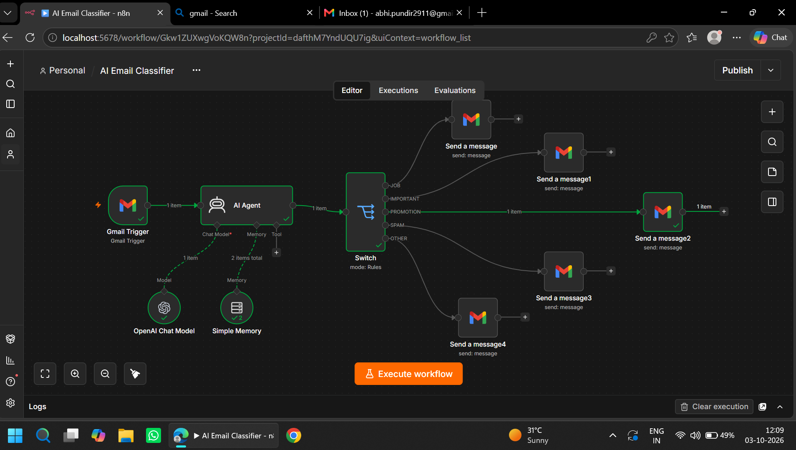
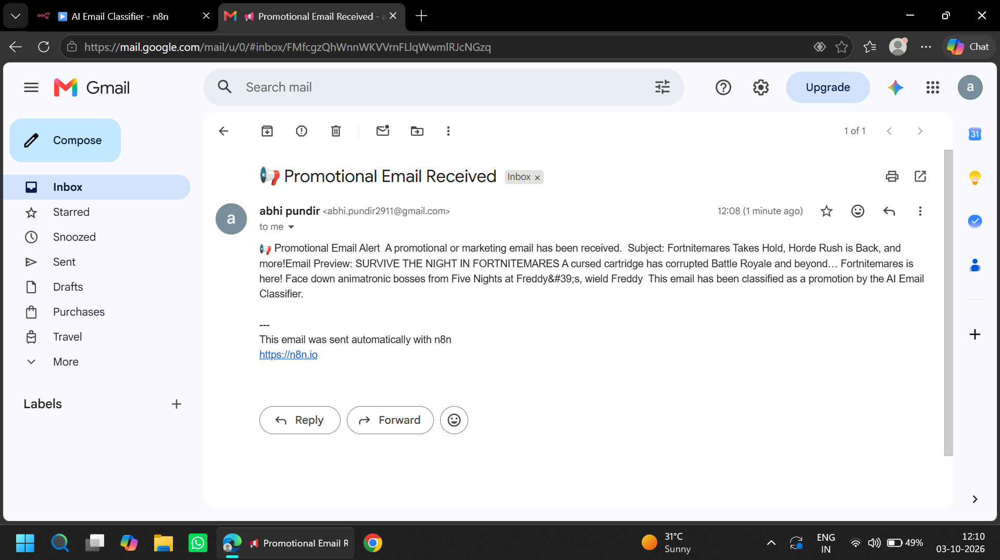
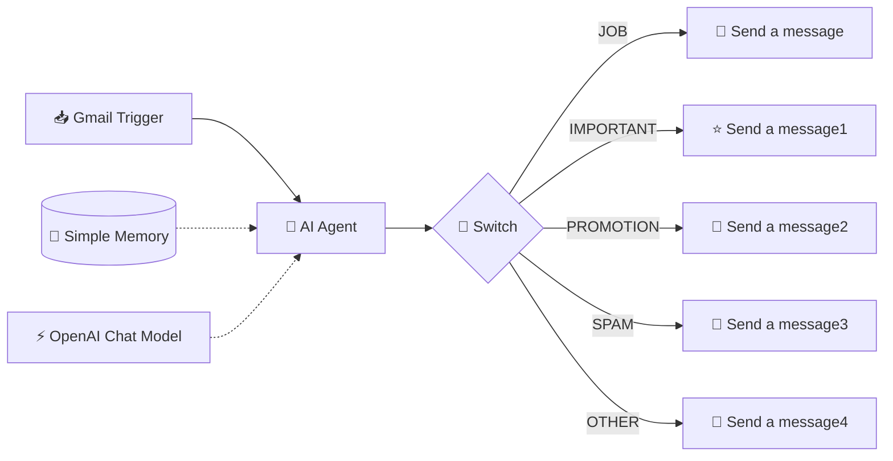

<div align="center">

# 📬 AI Email Classifier

### Let an AI agent read your inbox, so you don't have to.

An **n8n** workflow that watches your Gmail, classifies every incoming email with **OpenAI**, and sends you a clean, categorized alert automatically.

<br>


</div>

---

## ✨ Overview

Inboxes get noisy. This workflow plugs an **AI Agent** into Gmail so every new email is read, understood and sorted into a category, then routed to its own notification.

No manual rules. No keyword filters. Just an LLM that understands context.

> 📢 *Example:* A Fortnite promo lands in your inbox → the AI tags it as **PROMOTION** → you instantly get a neat "Promotional Email Received" alert with the subject and preview.

---

## 🖼️ Workflow Preview

<div align="center">



*The complete n8n workflow canvas*

</div>

<div align="center">



*A classified email alert delivered to Gmail*

</div>

> 💡 Create an `assets/` folder in your repo and drop in your two screenshots as `workflow.png` and `result.png`.

---

## 🧠 How It Works



1. **Gmail Trigger** fires whenever a new email arrives.
2. **AI Agent** reads the email, powered by the **OpenAI Chat Model** with **Simple Memory** for context.
3. The agent returns exactly one label: `JOB`, `IMPORTANT`, `PROMOTION`, `SPAM` or `OTHER`.
4. **Switch node** routes the email down the matching branch.
5. **Gmail "Send a message"** node delivers a formatted alert for that category.

---

## 🗂️ Categories

| Label | Meaning | Alert |
|-------|---------|-------|
| 💼 `JOB` | Recruiters, job postings, interview invites | Job email alert |
| ⭐ `IMPORTANT` | Time-sensitive or personal emails | Important email alert |
| 📢 `PROMOTION` | Marketing, offers, newsletters | Promotional email alert |
| 🚫 `SPAM` | Junk and suspicious messages | Spam alert |
| 📂 `OTHER` | Everything else | General alert |

---

## 🧰 Tech Stack

- **[n8n](https://n8n.io)**: workflow automation (self-hosted)
- **OpenAI Chat Model**: email understanding and classification
- **Simple Memory**: lightweight context for the agent
- **Gmail API**: trigger and send nodes
- **Switch (Rules mode)**: branch routing

---

## 🚀 Getting Started

### Prerequisites

- Node.js 18+ (or Docker)
- An [OpenAI API key](https://platform.openai.com/api-keys)
- A Google account with Gmail API OAuth credentials

### 1. Run n8n

```bash
# with npx
npx n8n

# or with Docker
docker run -it --rm -p 5678:5678 -v n8n_data:/home/node/.n8n n8nio/n8n
```

Open **http://localhost:5678**

### 2. Import the workflow

1. Click **Workflows → Import from File**
2. Select `AI Email Classifier.json`

### 3. Add credentials

| Node | Credential |
|------|-----------|
| Gmail Trigger | Gmail OAuth2 |
| OpenAI Chat Model | OpenAI API key |
| Send a message (x5) | Gmail OAuth2 |

### 4. Activate

Click **Publish** and send yourself a test email. 🎉

---

## 📨 Sample Output

```
📢 Promotional Email Alert

A promotional or marketing email has been received.

Subject: Fortnitemares Takes Hold, Horde Rush is Back, and more!
Preview: SURVIVE THE NIGHT IN FORTNITEMARES...

This email has been classified as a promotion by the AI Email Classifier.

---
This email was sent automatically with n8n
```

---

## 🛠️ Customization

- **Add categories**: add a new output rule in the Switch node and a matching Gmail node.
- **Tune the classifier**: edit the AI Agent's system prompt to change how emails are labelled.
- **Swap the model**: replace the OpenAI node with Gemini, Claude or a local Ollama model.
- **Other channels**: replace Gmail send with Slack, Telegram or WhatsApp.

---

## 🗺️ Roadmap

- [ ] Auto-apply Gmail labels per category
- [ ] Daily digest summary email
- [ ] Telegram / WhatsApp notifications
- [ ] Priority scoring for important emails
- [ ] Auto-reply drafts for job emails

---

## 🤝 Contributing

Pull requests are welcome. For major changes, open an issue first to discuss what you'd like to change.

---

## 📄 License

Released under the [MIT License](LICENSE).

---

<div align="center">

**Built with ❤️ and n8n by [Abhishek Pundir](https://github.com/Abhishek-max211)**

⭐ Star this repo if it saved your inbox!

</div>
