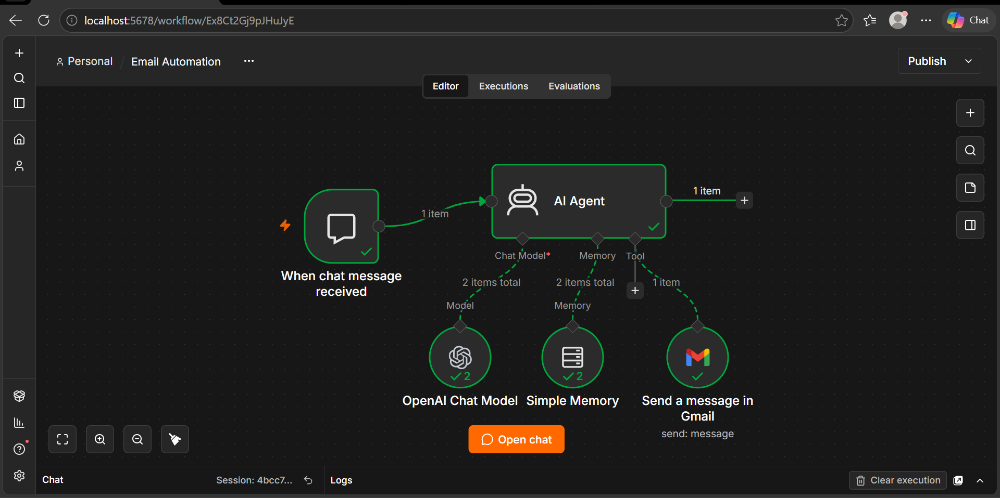

# 🤖 AI Email Automation using n8n

> An AI-powered email automation workflow built with **n8n**, integrating an AI Agent, OpenAI Chat Model, Simple Memory, and Gmail to automate email interactions.


---

## 📸 Workflow Overview



*Complete n8n workflow showing the Chat Trigger, AI Agent, OpenAI Chat Model, Simple Memory, and Gmail integration.*

## 🚀 About the Project

This project is my first AI-powered email automation workflow built using n8n.

It uses an AI Agent connected to an OpenAI Chat Model and Simple Memory to process chat instructions. The agent can use Gmail as a tool to send emails based on the user's request.

The goal is to explore how AI agents can interact with external applications and automate tasks through natural language instructions.

## ⚙️ Workflow Architecture

```text
User Message
     |
     v
When Chat Message Received
     |
     v
   AI Agent
     |
     |------ OpenAI Chat Model
     |
     |------ Simple Memory
     |
     |------ Gmail Tool
                  |
                  v
             Send Email
```

## 🛠️ Technologies Used

| Technology        | Purpose                                      |
| ----------------- | -------------------------------------------- |
| n8n               | Workflow automation                          |
| AI Agent          | Understands instructions and selects actions |
| OpenAI Chat Model | Processes natural language                   |
| Simple Memory     | Maintains conversation context               |
| Gmail             | Sends emails                                 |
| Chat Trigger      | Receives user messages                       |

## 🔄 How It Works

1. **Chat Trigger:** Starts the workflow when a user sends a message through the n8n chat interface.
2. **AI Agent:** Receives the message and determines the requested task.
3. **OpenAI Chat Model:** Interprets the instruction and generates the response or tool instructions.
4. **Simple Memory:** Provides conversation context to support follow-up interactions.
5. **Gmail Tool:** Allows the agent to send an email using the configured Gmail integration.
6. **Response:** The agent returns its result to the chat.

## ✨ Key Features

* 💬 Chat-based interaction
* 🤖 AI-powered instruction processing
* 📧 Gmail integration for sending messages
* 🧠 Conversation memory
* 🔗 Tool calling through an AI Agent
* ⚡ Automated workflow execution

## 📦 Setup and Configuration

### 1. Requirements

* An n8n instance
* An OpenAI API key and supported chat model
* A Gmail account
* Gmail OAuth2 credentials configured in n8n

### 2. Import the Workflow

1. Download the workflow JSON from this repository.
2. Open your n8n editor.
3. Import the workflow JSON.
4. Review the imported nodes and connections.

### 3. Configure Credentials

**OpenAI Chat Model**

* Add your OpenAI credentials.
* Select an available chat model.
* Verify that the model connection works.

**Gmail**

* Configure Gmail OAuth2 credentials.
* Grant the required permissions.
* Select the appropriate Gmail account in the node.

### 4. Test the Workflow

1. Open the chat interface.
2. Send a test instruction.
3. Verify that the AI Agent processes the request.
4. Check the Gmail node execution.
5. Confirm that the email was delivered or inspect the Gmail Sent folder.

## 🧪 Example Instructions

```text
Send an email to example@gmail.com
with the subject "Project Update"
and message "The project is completed."
```

The AI Agent can interpret the instruction and use the connected Gmail tool to perform the requested action, subject to its configuration and permissions.

## 🔐 Security

* Never upload API keys or OAuth tokens to GitHub.
* Configure credentials securely inside n8n.
* Avoid sharing private email addresses and sensitive message content in test data.
* Review AI-generated email content before using the workflow for important communication.
* Restrict access to the workflow and its connected accounts.

## 📚 Concepts Learned

* Building AI Agent workflows in n8n
* Connecting an LLM to an AI Agent
* Using memory in conversational workflows
* Connecting external applications as agent tools
* Configuring Gmail OAuth2
* Testing and troubleshooting automation workflows
* Exporting and maintaining workflows with GitHub

## 🎯 Future Improvements

* Add email summarization.
* Support email drafting and review before sending.
* Add input validation and recipient checks.
* Implement better error handling and failure notifications.
* Add safeguards against duplicate emails.
* Improve conversation memory and context management.

## 👨‍💻 Author

**Abhishek Pundir**

Exploring AI automation, n8n, cloud, DevOps, and practical workflow engineering.

---

⭐ If you find this project useful, consider starring the repository!
