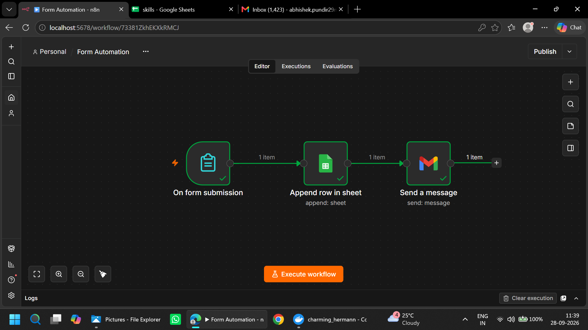
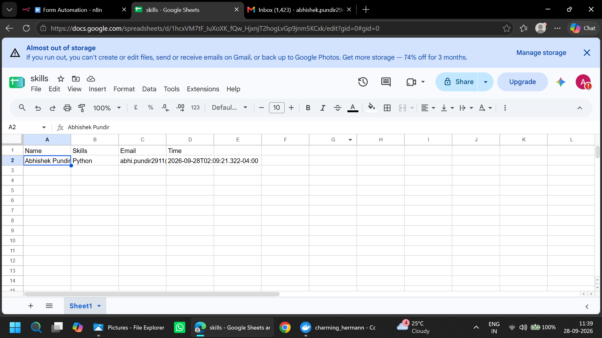
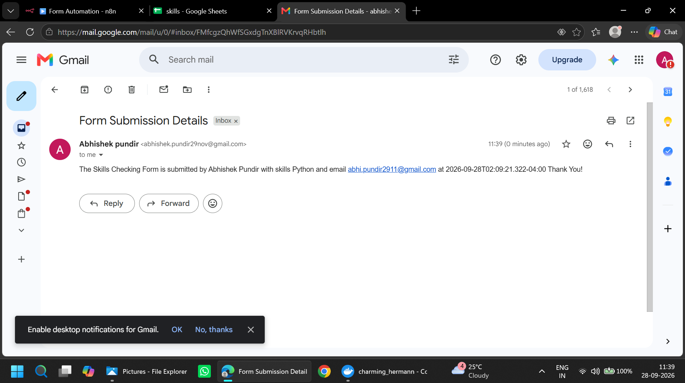

# Form Automation with n8n

An automated form submission workflow built using **n8n, Google Sheets, and Gmail**. This project collects user skills through a form, saves responses to Google Sheets, and sends an email notification automatically.

## Workflow Overview



**Workflow:** Form Submission → Google Sheets → Gmail

## Tools & Technologies

* **n8n** — Workflow automation
* **Google Forms / n8n Form Trigger** — Data collection
* **Google Sheets** — Store form responses
* **Gmail** — Email notifications
* **Google OAuth 2.0** — Authentication

## How It Works

### 1. Form Submission

The workflow starts when a user submits the Skills Checking Form.

The form collects:

* Name
* Skills
* Email

### 2. Google Sheets Integration

After submission, n8n automatically appends the form data to Google Sheets.



The spreadsheet stores:

| Name      | Skills      | Email      | Time            |
| --------- | ----------- | ---------- | --------------- |
| User name | User skills | User email | Submission time |

### 3. Gmail Notification

After the data is added to Google Sheets, n8n sends an email containing the form submission details.



Example:

* Name: Abhishek Pundir
* Skills: Python
* Email: Submitter's email

## Complete Automation Flow

```text
User submits form
       |
       v
On Form Submission
       |
       v
Google Sheets
(Append Row)
       |
       v
Gmail
(Send Message)
       |
       v
Automation Completed
```

## Setup

1. Create a workflow in n8n.
2. Add the **On Form Submission** trigger.
3. Configure the form fields.
4. Add a Google Sheets node and select **Append Row**.
5. Connect your Google account and map the form fields to the sheet columns.
6. Add a Gmail node and configure the email recipient, subject, and message.
7. Test the workflow and verify the spreadsheet and email.
8. Activate or publish the workflow for live submissions.

## Features

* Automated form data collection
* Automatic spreadsheet updates
* Email notifications
* Connected workflow with no manual data entry
* Easy to extend with additional fields and actions

## What I Learned

* Building workflows using n8n
* Integrating Google Sheets and Gmail
* Configuring OAuth credentials
* Mapping data between nodes
* Testing and troubleshooting automation workflows

## Future Improvements

* Add form validation
* Send personalized confirmation emails
* Add error handling
* Prevent duplicate submissions
* Add more fields and integrations

## Repository Structure

```text
Form-Automation/
├── README.md
├── Form_Automation.png
├── Gmail.png
└── Google_Sheets.png
```
---

**Built with n8n | Google Sheets | Gmail**
