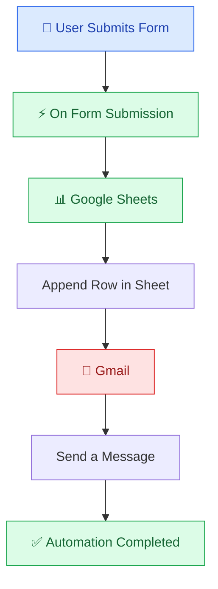

# ⚡ Form Automation using n8n

<p align="center">
  
  
  
  
</p>

<p align="center">
  <b>Automating form submissions, spreadsheet updates, and email notifications using n8n.</b>
</p>

---

## 📌 Project Overview

**Form Automation** is a workflow automation project built using **n8n, Google Sheets, and Gmail**.

The workflow collects user information through an n8n form, automatically stores the submitted data in Google Sheets, and sends an email notification through Gmail.

The goal of this project is to eliminate repetitive manual data entry and demonstrate how different applications can work together in an automated workflow.

## 📸 Workflow Preview

<p align="center">
  
</p>

<p align="center">
  <i>Complete n8n workflow connecting Form Submission, Google Sheets, and Gmail.</i>
</p>

---

## ✨ Key Features

| Feature               | Description                                     |
| --------------------- | ----------------------------------------------- |
| 📝 Form Submission    | Collects user information through an n8n form   |
| 📊 Google Sheets      | Automatically saves submitted data              |
| 📧 Gmail Integration  | Sends an email notification after submission    |
| ⚡ Workflow Automation | Connects all steps into one automated process   |
| 🔄 Data Mapping       | Transfers form fields between workflow nodes    |
| ✅ Instant Processing  | Executes the connected actions after submission |

---

## 🏗️ Workflow Architecture



### Workflow Components

**1. 📝 On Form Submission**

The workflow starts when a user submits the Skills Checking Form.

The form collects information such as:

* **Name** — User's full name
* **Skills** — Technical or professional skills
* **Email** — User's email address

The form trigger captures the submitted information and passes it to the next node.

**2. 📊 Append Row in Google Sheets**

The Google Sheets node receives the form data and appends it to the selected spreadsheet.

Each new submission is saved as a separate row, making the responses easy to organize and review.

**3. 📧 Send a Message with Gmail**

After the spreadsheet operation, the Gmail node sends an email containing the form submission details.

This creates an automated notification step without manually composing an email for every submission.

---

## 🛠️ Technologies Used

<p>
  
  
  
  
</p>

| Technology       | Purpose                               |
| ---------------- | ------------------------------------- |
| n8n              | Workflow automation and orchestration |
| n8n Form Trigger | Captures form submissions             |
| Google Sheets    | Stores submitted information          |
| Gmail            | Sends email notifications             |
| Google OAuth2    | Authenticates Google integrations     |

---

## 🔄 How It Works

The automation follows a simple three-step process.

**Step 1 — Form Submission**

A user opens the Skills Checking Form and enters their information.

Example:

```text
Name: Abhishek Pundir
Skills: Python
Email: abh.pundir29@gmail.com
```

**Step 2 — Store Data in Google Sheets**

After the form is submitted, n8n maps the submitted fields to the corresponding spreadsheet columns.


Example spreadsheet structure:

| Name            | Skills | Email      | Time            |
| --------------- | ------ | ---------- | --------------- |
| Abhishek Pundir | Python | User email | Submission time |

**Step 3 — Send Email Notification**

Once the Google Sheets node completes, the Gmail node sends the configured email.


Example email:

**Subject:** Form Submission Details

```text
The Skills Checking Form has been submitted.

Name: Abhishek Pundir
Skills: Python
Email: User email

Thank You!
```

---

## 🚀 Getting Started

### 📋 Prerequisites

Before running this workflow, make sure you have:

* An n8n instance (local, self-hosted, or cloud)
* A Google account
* Google Sheets API enabled in Google Cloud
* Google Sheets credentials configured in n8n
* Gmail credentials configured in n8n

### 1️⃣ Create the Workflow

1. Open your n8n instance.
2. Create a new workflow.
3. Add the **On Form Submission** trigger.
4. Configure the form title, description, and fields.
5. Save the node.

### 2️⃣ Configure Google Sheets

1. Add a Google Sheets node.
2. Connect it to the Form Trigger.
3. Select the **Append Row** operation.
4. Connect your Google account using OAuth2.
5. Select the spreadsheet and worksheet.
6. Map the form fields to the correct columns.

### 3️⃣ Configure Gmail

1. Add a Gmail node after Google Sheets.
2. Select the **Send a Message** operation.
3. Connect your Gmail account.
4. Configure the recipient, subject, and message body.
5. Insert the appropriate form values using n8n expressions.
6. Save the node.

### 4️⃣ Test the Workflow

1. Execute the workflow in test mode.
2. Open the test form URL.
3. Enter sample information and submit the form.
4. Verify that Google Sheets receives a new row.
5. Check Gmail to confirm the notification was sent.
6. Review the execution in n8n to identify any errors.

### 5️⃣ Activate the Workflow

After successful testing:

1. Activate or publish the workflow, depending on your n8n version.
2. Open the production form URL.
3. Share the form with users who need to submit their information.
4. Monitor workflow executions to ensure the automation continues working.

---

## 📂 Repository Structure

```text
form-automation/
│
├── README.md
├── Form_Automation.png
├── Google_Sheets.png
├── Gmail.png
│
└── workflow.json
```

| File                  | Description                    |
| --------------------- | ------------------------------ |
| `README.md`           | Project documentation          |
| `Form_Automation.png` | Complete workflow screenshot   |
| `Google_Sheets.png`   | Spreadsheet output screenshot  |
| `Gmail.png`           | Email notification screenshot  |
| `workflow.json`       | Optional exported n8n workflow |

**Note:** Keep the three PNG screenshots in the repository root so the relative image links in this README work.

Only upload a sanitized workflow export. Remove credentials and private information before publishing.

---

## 🔐 Security & Best Practices

* 🔒 Never upload API keys, passwords, OAuth tokens, or credential exports to GitHub.
* 🔑 Store Google credentials securely in n8n.
* 📩 Avoid exposing real email addresses or private form responses in public screenshots.
* 🛡️ Restrict access to your workflow and connected accounts.
* 🧪 Use test data while developing and demonstrating the project.
* 📊 Review the spreadsheet's sharing permissions before collecting real submissions.

---

## 🧠 Concepts & Skills Learned

Through this project, I practiced:

* Building event-driven workflows using n8n
* Creating forms and capturing user responses
* Integrating Google Sheets with n8n
* Configuring Gmail OAuth2 credentials
* Mapping data between workflow nodes
* Automating spreadsheet updates
* Sending automated email notifications
* Testing and troubleshooting multi-step workflows
* Documenting projects for GitHub

---

## 🔮 Future Improvements

* 📬 **Personalized Confirmation:** Send a customized confirmation email directly to the person submitting the form.
* ✅ **Form Validation:** Validate required fields and email formats.
* 🚨 **Error Handling:** Notify the workflow owner if a Google Sheets or Gmail operation fails.
* 🔁 **Duplicate Detection:** Identify repeated submissions.
* 📊 **Reporting:** Generate summaries of submitted skills and response counts.
* 🤖 **AI Integration:** Use an AI Agent to categorize skills or summarize responses.

---

## 👨‍💻 About Me

**Abhishek Pundir**

Exploring **AI Automation, n8n, Cloud, DevOps, and practical workflow engineering**.

I enjoy building hands-on projects that connect different tools and automate real-world tasks.

---

<p align="center">
  <b>⭐ If you find this project useful, consider giving the repository a star!</b>
</p>

<p align="center">
  <i>Built with ⚡ n8n, 📊 Google Sheets, and 📧 Gmail</i>
</p>
