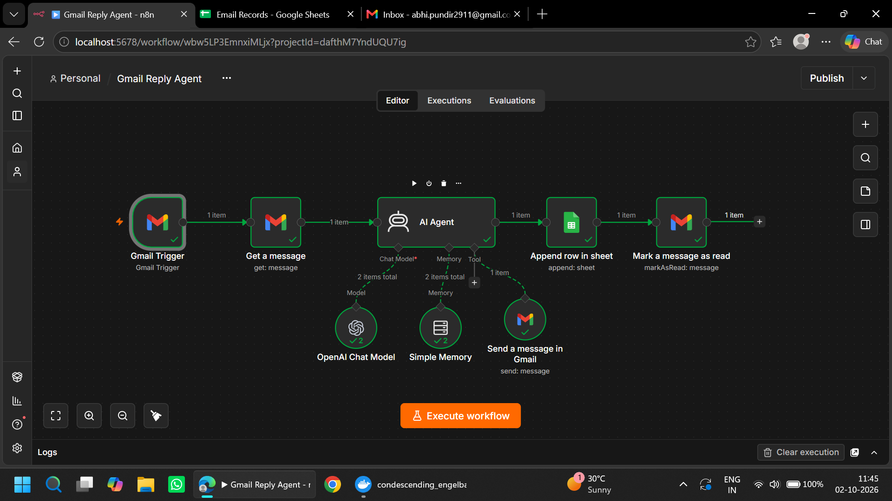
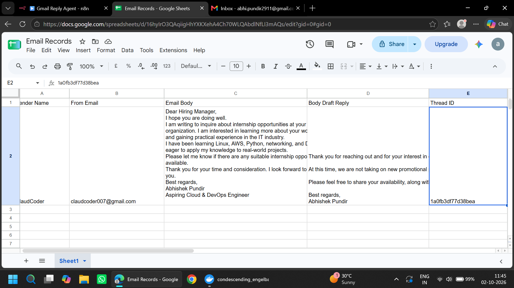
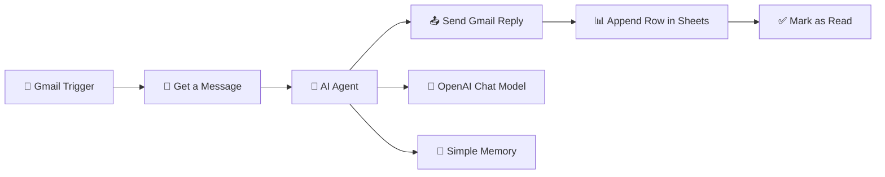

# 🤖 Gmail Reply Agent | AI-Powered Email Automation

<div align="center">

### Automate your inbox. Generate smarter replies. Save time.

An intelligent email automation workflow built with **n8n, OpenAI, Gmail, and Google Sheets**.


</div>

---

## 📌 Overview

**Gmail Reply Agent** is an AI-powered workflow that automatically reads incoming emails, understands their content, generates professional replies, sends responses through Gmail, and stores email records in Google Sheets.

The project demonstrates how AI agents and workflow automation can work together to reduce repetitive tasks and streamline email communication.

## ✨ Features

| Feature                | Description                                |
| ---------------------- | ------------------------------------------ |
| 📩 Gmail Trigger       | Detects incoming emails automatically      |
| 📖 Email Reader        | Retrieves the sender and email content     |
| 🧠 AI Reply Generation | Creates relevant, professional responses   |
| 📤 Auto Reply          | Sends responses through Gmail              |
| 📊 Google Sheets       | Saves email details and generated replies  |
| ✅ Read Status          | Marks processed emails as read             |
| 🧠 Simple Memory       | Provides conversation context to the agent |

## 🖥️ Project Preview

### 1. n8n Workflow



*Complete automation workflow showing the Gmail Trigger, AI Agent, OpenAI Chat Model, Simple Memory, Gmail tools, and Google Sheets integration.*

### 2. Google Sheets Email Records



*Stores sender information, original email content, AI-generated replies, and Gmail thread IDs.*

## 🏗️ Workflow Architecture



## ⚙️ Tech Stack

<div align="center">

| Technology        | Role                                     |
| ----------------- | ---------------------------------------- |
| n8n               | Workflow orchestration                   |
| OpenAI            | Email understanding and reply generation |
| Gmail API         | Email reading and sending                |
| Google Sheets API | Record storage                           |
| Simple Memory     | Conversation context                     |

</div>

## 🔄 How It Works

**01 — 📩 Email Detection**

The Gmail Trigger monitors the inbox and starts the workflow when a new email arrives.

**02 — 📖 Retrieve Email**

The Get a Message node retrieves the email body and message details needed for processing.

**03 — 🤖 AI Processing**

The AI Agent analyzes the email using the connected OpenAI Chat Model. Simple Memory can provide additional context.

**04 — 📤 Send Reply**

The Gmail tool sends the generated response to the appropriate email conversation.

**05 — 📊 Store Records**

Google Sheets receives the sender details, original email, AI-generated reply, and thread ID.

**06 — ✅ Mark as Read**

The final Gmail node marks the processed message as read.

## 📊 Google Sheets Structure

| Column           | Data                      |
| ---------------- | ------------------------- |
| Sender Name      | Name of the email sender  |
| From Email       | Sender's email address    |
| Email Body       | Original incoming message |
| Body Draft Reply | AI-generated response     |
| Thread ID        | Gmail conversation ID     |

## 🚀 Installation & Setup

### Prerequisites

* n8n (self-hosted or cloud)
* Gmail account
* Google Sheets account
* OpenAI API key

### Step 1 — Import the Workflow

1. Open your n8n instance.
2. Create a new workflow.
3. Import your exported Gmail Reply Agent workflow JSON, or recreate the nodes using the architecture above.

### Step 2 — Connect Gmail

1. Create Gmail OAuth2 credentials in n8n.
2. Connect your Gmail Trigger.
3. Configure Get a Message to retrieve the incoming email.
4. Configure the Gmail Send Message tool and Mark as Read node.

### Step 3 — Configure OpenAI

1. Add your OpenAI credentials in n8n.
2. Connect the OpenAI Chat Model to the AI Agent.
3. Set instructions for concise, helpful, professional email replies.
4. Connect Simple Memory if conversation context is required.

### Step 4 — Connect Google Sheets

1. Create a spreadsheet named `Email Records`.
2. Add the five column headers listed above.
3. Connect Google Sheets credentials in n8n.
4. Select the Append Row operation.
5. Map the email and AI output fields to the correct columns.

### Step 5 — Test & Activate

1. Send a test email to your connected Gmail inbox.
2. Execute the workflow and inspect each node.
3. Verify the AI response, sent email, spreadsheet record, and read status.
4. Activate the workflow after confirming the results.

## 🧪 Example

**Incoming Email**

> Subject: Internship Opportunity
>
> Dear Hiring Manager,
> I am writing to inquire about internship opportunities at your organization. I am interested in gaining practical experience in the IT industry.

**Example AI Reply**

> Thank you for reaching out and for your interest in our organization. Please share your availability and relevant details so we can discuss potential opportunities.
>
> Best regards,
> Hiring Team

*The actual response depends on the incoming message and the instructions configured for the AI Agent.*

## 🔐 Security & Reliability

* 🔑 Store API keys and OAuth credentials in n8n's credential manager.
* 🛡️ Do not publish tokens, credentials, or private email content.
* 👤 Consider human approval before sending AI-generated replies.
* 🔁 Prevent duplicate replies by tracking processed message IDs.
* ⚠️ Add error handling for failed API requests and workflow steps.
* 🧪 Test with sample emails before enabling automatic replies.

## 💡 Future Enhancements

* [ ] Human approval before sending replies
* [ ] Email categorization using AI
* [ ] Priority detection for urgent emails
* [ ] Telegram notifications for important messages
* [ ] Duplicate email detection
* [ ] Daily email activity reports
* [ ] Email analytics dashboard
* [ ] Automatic follow-up reminders

## 🎯 What I Learned

Through this project, I practiced:

* Building multi-step workflows in n8n
* Connecting external APIs using OAuth
* Integrating OpenAI with an AI Agent
* Working with Gmail automation
* Storing structured records in Google Sheets
* Using memory in AI workflows
* Testing and debugging connected services
* Designing practical business automation

## 📁 Repository Structure

```text
gmail-reply-agent/
│
├── README.md
├── workflow/
│   └── gmail-reply-agent.json
│
└── images/
    ├── workflow.png
    └── google-sheets.png
```

## 👨‍💻 Author

**Abhishek Pundir**
Aspiring Cloud & DevOps Engineer | AI Automation Enthusiast

Building practical projects with Linux, AWS, Python, n8n, and automation.

* GitHub: [Abhishek Pundir](https://github.com/Abhishek-max211)
* Project: Gmail Reply Agent

---

<div align="center">

### ⭐ If you find this project useful, give it a star!

**Built with 🤖 AI + ⚙️ Automation + ☁️ Technology**

</div>
