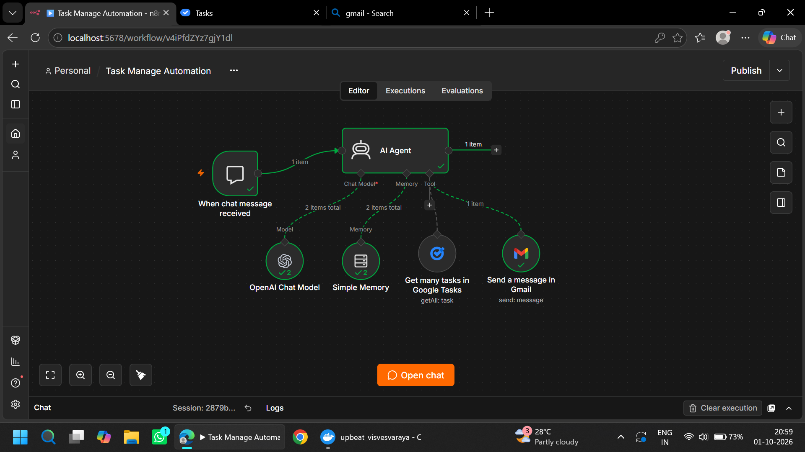
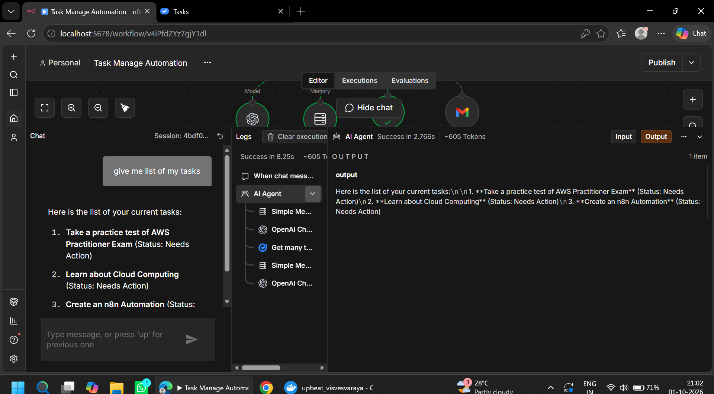
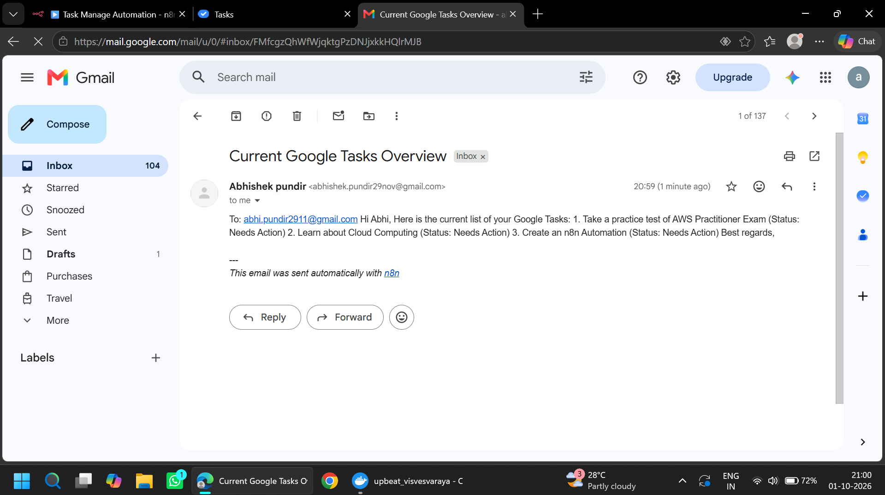
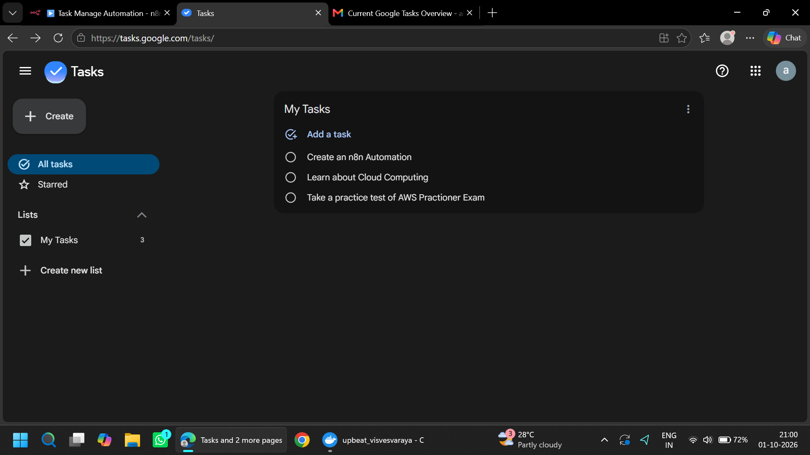

# 🤖 Task & Email Automation using n8n

> An AI-powered task assistant built with **n8n**, **Google Tasks**, and
> **Gmail**. Chat with the workflow to view your tasks, then receive the
> task list by email.


## 📌 Project Overview

This project connects an n8n chat trigger to an AI Agent that can
retrieve tasks from Google Tasks and send a formatted task overview
through Gmail. It helps reduce manual checking and makes it easier to
keep track of pending work.

## ✨ Features

-   💬 **Chat-based interaction:** Ask the assistant questions in the
    n8n chat.
-   📋 **Google Tasks integration:** Retrieve tasks using the Google
    Tasks tool.
-   🧠 **AI Agent with memory:** Uses an OpenAI Chat Model and Simple
    Memory to handle the conversation.
-   📧 **Email delivery:** Sends the task overview to your configured
    email address through Gmail.
-   🔁 **Connected workflow:** Combines chat, AI, task retrieval, and
    email in one automation.

## ⚙️ Workflow

1.  **When chat message received** --- starts the workflow when you send
    a message.
2.  **AI Agent** --- interprets your request and decides what action to
    take.
3.  **OpenAI Chat Model** --- provides the language model for the agent.
4.  **Simple Memory** --- provides conversational context during the
    chat session.
5.  **Get many tasks in Google Tasks** --- retrieves your task items
    when requested by the agent.
6.  **Send a message in Gmail** --- emails the task summary to the
    configured recipient.

### Workflow Diagram

Add your workflow screenshot to the repository at
`screenshots/workflow.png`, then uncomment this line:

```{=html}
<!--  -->
```
## 🧰 Tech Stack

  Technology          Purpose
  ------------------- -------------------------------------------------
  n8n                 Workflow automation and orchestration
  AI Agent            Understands chat requests and coordinates tools
  OpenAI Chat Model   Natural-language processing
  Simple Memory       Conversation context
  Google Tasks        Task data source
  Gmail               Email delivery

## 🗨️ Example

**You:** `give me list of my tasks`

**Assistant:** Returns your current tasks in chat, including their
status when available.

**Email:** Sends the task overview to your configured Gmail recipient.

Example tasks shown during testing: - Take a practice test of AWS
Practitioner Exam - Learn about Cloud Computing - Create an n8n
Automation

## 🔐 Prerequisites

Before running the workflow, you need:

-   An n8n instance (local or hosted).
-   An OpenAI API credential/model configured for the AI Agent.
-   Google Tasks credentials with access to the task list.
-   Gmail credentials and permission to send email.

## 🚀 Setup

1.  Open your n8n instance.
2.  Import the workflow JSON file (if included in this repository).
3.  Open the **OpenAI Chat Model** node and select or configure your
    model credentials.
4.  Configure **Google Tasks** credentials and choose the task
    list/resource settings.
5.  Configure **Gmail** credentials and set the recipient, subject, and
    message fields.
6.  Check the AI Agent instructions so it knows when to retrieve tasks
    and when to send an email.
7.  Save the workflow and test it using the chat panel.
8.  Verify that the task list appears in chat and that the email
    arrives.

> **Note:** Exact node fields and credential screens can vary by n8n
> version. Never commit API keys, OAuth tokens, passwords, or personal
> email data to GitHub.

## 🧪 Testing Checklist

-   [ ] Send a chat message asking for your tasks.
-   [ ] Confirm the AI Agent runs successfully.
-   [ ] Confirm Google Tasks returns the expected items.
-   [ ] Confirm the response is readable in chat.
-   [ ] Confirm Gmail sends the summary to the intended address.
-   [ ] Test what happens when the task list is empty or a credential is
    missing.

## 📁 Suggested Repository Structure

``` text
task-email-automation/
├── README.md
├── workflow/
│   └── task-email-automation.json
└── screenshots/
    ├── workflow.png
    ├── chat.png
    ├── email.png
    └── tasks.png
```

Place your exported n8n workflow JSON in `workflow/` and your
screenshots in `screenshots/`. Update the screenshot links below once
the images are committed.

## 🖼️ Screenshots








## 🌱 What I Learned

-   Building an AI Agent workflow in n8n.
-   Connecting an AI model with memory and external tools.
-   Integrating Google Tasks and Gmail.
-   Testing a multi-step automation from a chat interface.
-   Handling credentials and validating workflow outputs.

## 🔮 Future Improvements

-   Add task creation, updating, and completion actions.
-   Support filtering tasks by due date or status.
-   Add scheduled daily or weekly task emails.
-   Improve email formatting with HTML templates.
-   Add error handling and notifications for failed executions.

## 👨‍💻 Author

**Abhishek Pundir**\
Building practical projects in automation, cloud, and DevOps.

------------------------------------------------------------------------

⭐ If you find this project useful, feel free to star the repository!
